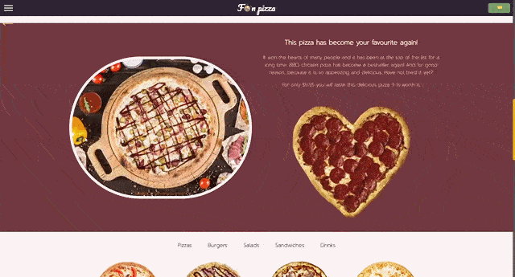

# Funpizza 🍕

> Pizzeria website with delicious food 🍴

### See the <a href='https://dnt-knw.github.io/Funpizza' target='_blank' title='Click to open the project'> Demo </a> 👁

## Description 📖

### You can find here 🔍

- Products to your liking, such as
    - Pizza 🍕
    - Burgers 🍔
    - Salads 🥗
    - Sandwiches 🥪
    - Drinks 🥤
- Beautiful and smooth transitions and animations 🙌
- Pleasant to the eye design 👁

## What you can do ❓

- ✅ Fill out the form and send suggestions
- ✅ Add or remove products from the shopping cart
- ✅ Buy products or completely clear the shopping cart
- ✅ Hide the header for a better view

## Additional info 📝

- ⚠️ The app calculates the total price of the cart
- ⚠️ When you hover the cursor over the cross on the product that you want to remove from the cart, the app will recalculate the total price without taking into account this product
- ⚠️ If there are still products in the cart, then you will see an animation at the top right corner
- ⚠️ When you make a buy, you will see how much you paid and for how many products
- ⚠️ There is a phone number validation in the form, so enter an American cell phone number starting with +1 code
